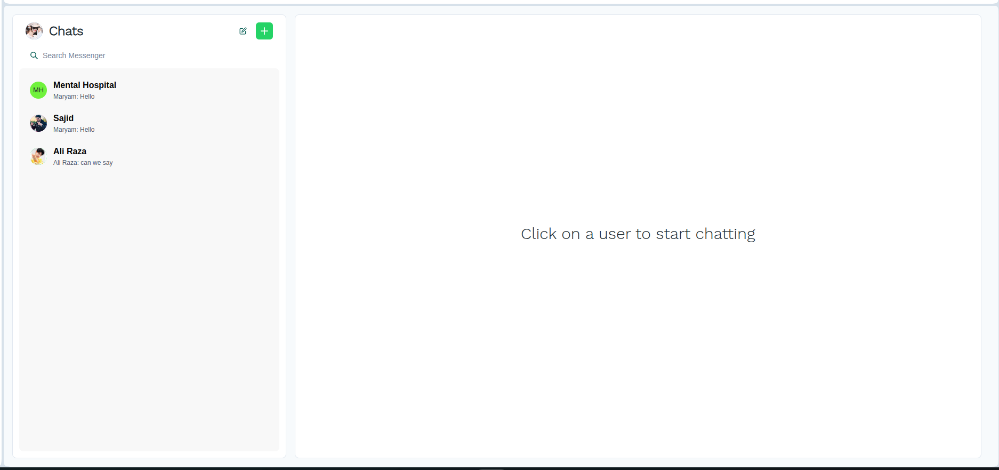
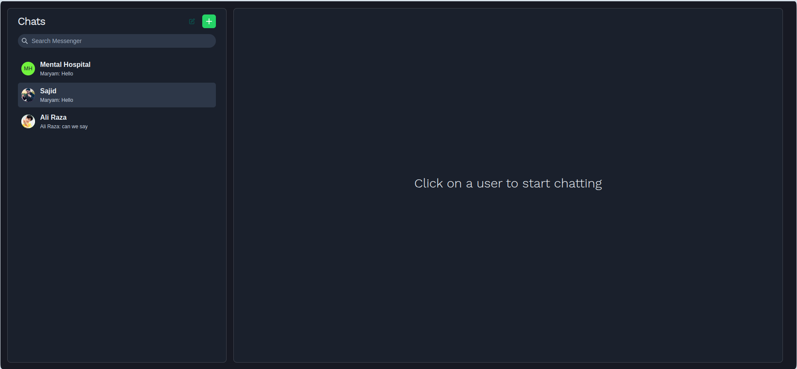
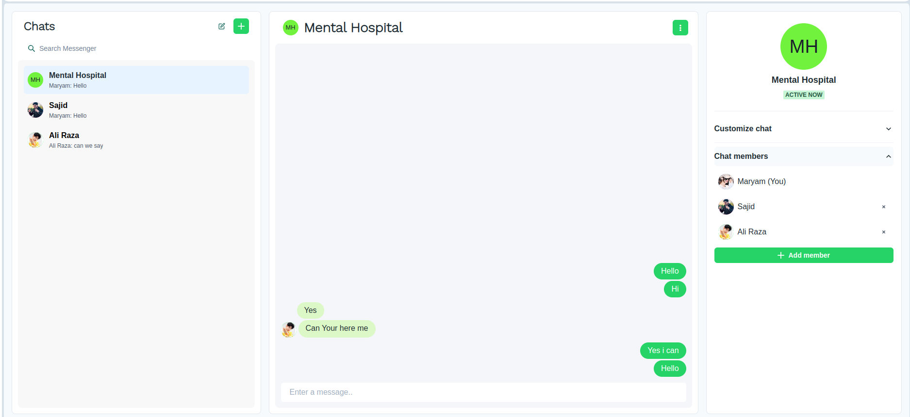
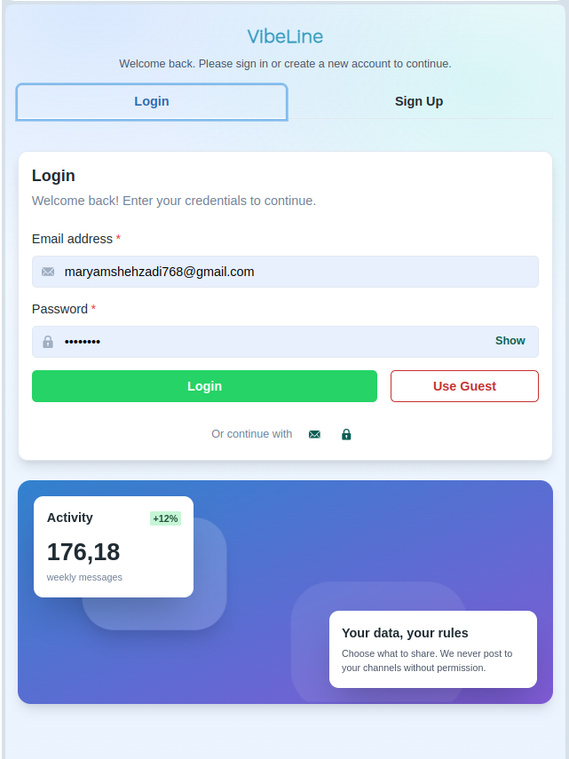
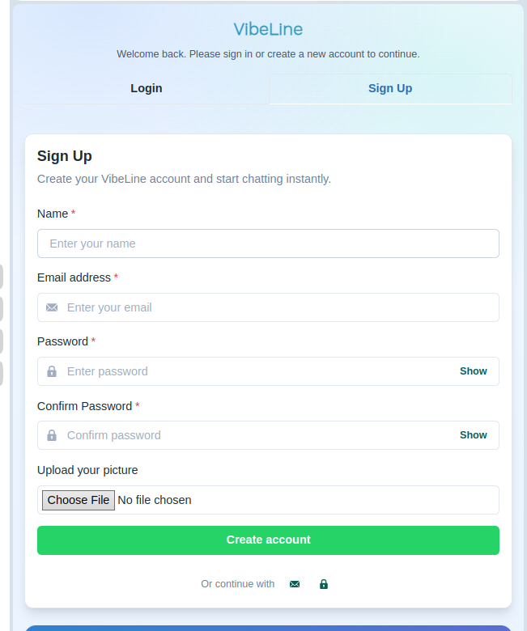
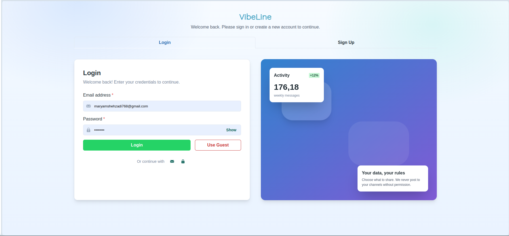
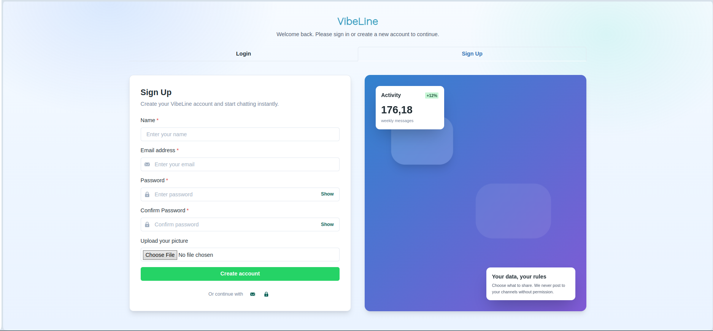

## VibeLine – Real‑time Messenger (MERN)

VibeLine is a modern, full‑stack chat application built with the MERN stack. It supports one‑to‑one and group conversations, live typing indicators, notifications, nicknames, a theme switcher (Light/Dark), rich member management for groups, and a clean responsive UI.

### Tech stack

- **Client**: React, Chakra UI, Socket.io client
- **Server**: Node.js, Express, Socket.io
- **Database**: MongoDB (Mongoose)

### Key features

- **Authentication** (email/password) and protected APIs
- **Live messaging** with Socket.io (typing, instant delivery)
- **One‑to‑one and group chats**
- **Nicknames**: show a custom display name per chat
- **Theme**: Light/Dark toggle, persisted per user
- **Members**: search, add/remove users, and rename group
- **User profile**: view, edit name/photo, and logout
- **Smart sidebar search**: search existing chats or any user and start a chat instantly

## Screenshots

### Desktop – Light theme


### Desktop – Dark theme


### Group chat


### Auth (mobile)



### Auth (desktop)



## Getting started

```

### 1) Install dependencies
```bash
# install root deps (backend)
npm install

# install frontend deps
cd frontend
npm install
```

### 2) Environment variables

Create a `.env` in `backend/` with at least:
```bash
MONGO_URI=mongodb+srv://<your-connection-string>
JWT_SECRET=<strong-secret>
NODE_ENV=development
PORT=5000
```

### 3) Run the app (two terminals)
```bash
# terminal 1 – backend
npm run start

# terminal 2 – frontend
cd frontend
npm start
```

The client runs on `http://localhost:3000` and proxies API requests to the server on `http://127.0.0.1:5000`.

## Project structure

- `backend/` – Express server, Socket.io, MongoDB models and routes
- `frontend/` – React app with Chakra UI components and context
- `screenshots/` – images used in this README

## Development notes

- Theme preference is saved per user and applied across the app.
- Group actions (add/remove/rename) and nicknames are available from the right info panel.
- Profile menu lets you update name/photo or logout.


